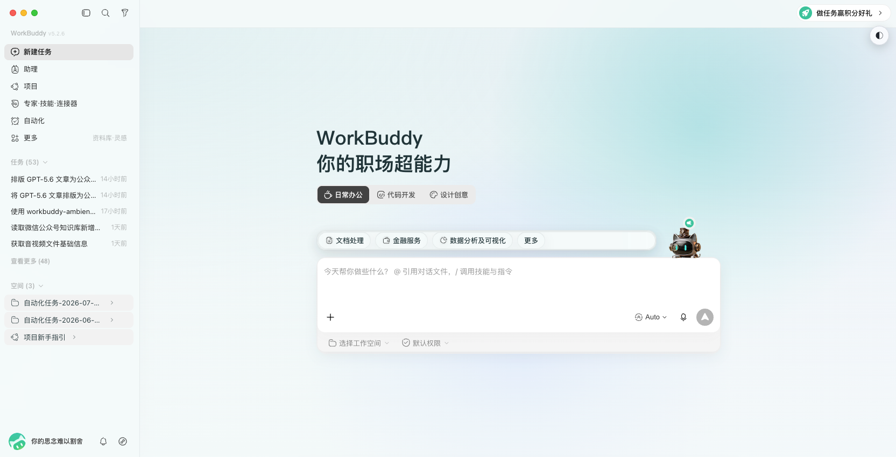
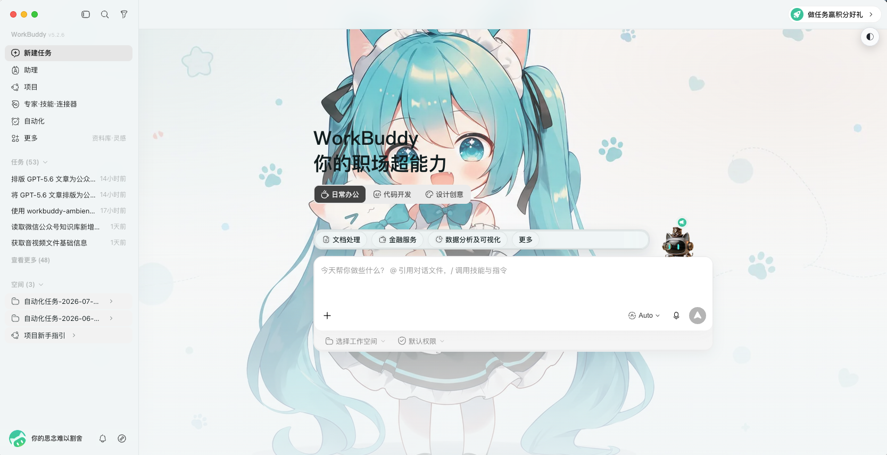
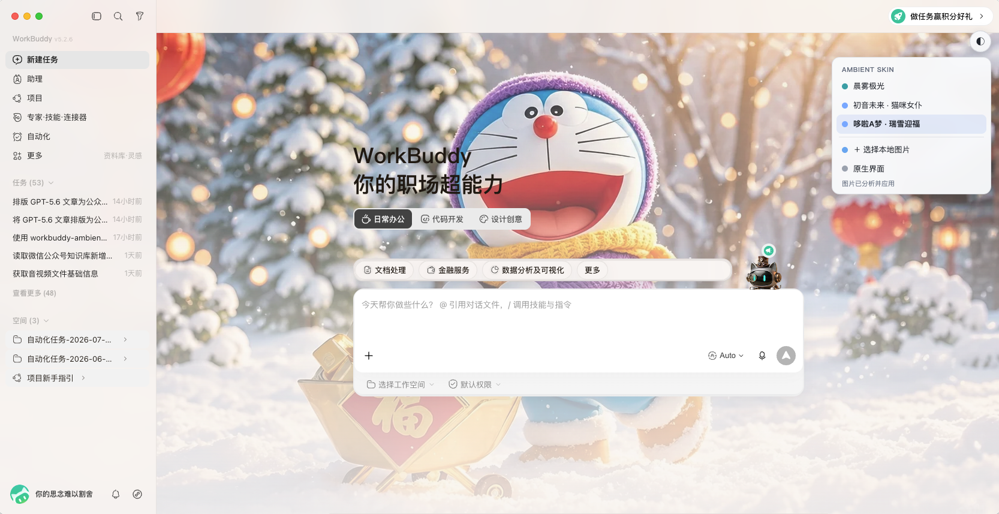

# WorkBuddy Ambient Skin

WorkBuddy 不必一直是一块灰色的工作面板。

Ambient Skin 让首页留住一张你喜欢的画面；进入对话、任务或详情后，背景会自动安静下来。侧栏、输入框和菜单仍是 WorkBuddy 原来的样子，变化的只是工作空间的光线、颜色和气氛。

> 非腾讯官方产品。支持 macOS 与 Windows，不修改 WorkBuddy 应用、`app.asar` 或应用签名。

## 它改变什么

- **改空间，不改控件**：保留原生交互，用 Material Layer 分别处理顶栏、侧栏、卡片、输入框和详情区。
- **知道什么时候收敛**：首页完整呈现，工作页降低对比度，详情页进一步淡出。
- **看得懂你的图片**：用 OKLCH 感知色彩提取主色与差异化辅色，并判断明暗、视觉焦点和文字安全区。
- **随时换，也随时退**：右上角切换主题；暂停或完整恢复都不碰官方安装文件。

## 一分钟开始

如果你在支持 Skill 的 AI 中使用它，直接说：

> 使用 `workbuddy-ambient-skin` 给我的 WorkBuddy 换一个安静的皮肤。

AI 会按 [SKILL.md](SKILL.md) 检查环境、推荐主题，并在需要重启 WorkBuddy 前征得确认。

手动使用只需要三步。macOS：

```bash
scripts/workbuddy-ambient.sh doctor
scripts/workbuddy-ambient.sh list
scripts/workbuddy-ambient.sh apply --theme paper-aurora --restart confirmed
```

Windows PowerShell：

```powershell
.\scripts\workbuddy-ambient.ps1 doctor
.\scripts\workbuddy-ambient.ps1 list
.\scripts\workbuddy-ambient.ps1 apply --theme paper-aurora --restart confirmed
```

Windows 会从当前环境发现 WorkBuddy；特殊安装位置可显式指定：

```powershell
.\scripts\workbuddy-ambient.ps1 -WorkBuddyExe "D:\Apps\WorkBuddy\WorkBuddy.exe" doctor
```

`apply` 会重启 WorkBuddy 并应用主题；已开启 CDP 时可用 `switch` 瞬时切换。重启前请先保存未完成的输入或任务。Ambient Skin 固定使用 CDP 端口 `9347`；端口被占用时会明确报错，不会自动漂移。

Agent 执行时会返回 `status: launched`，并通过 macOS LaunchServices 打开一个临时 `.command`（等价于双击脚本）。Terminal 会独立运行同一份 `apply.command`，关闭 WorkBuddy 后仍会继续完成 CDP 启动、注入和校验；不需要 AppleScript 自动化权限或 `launchctl`，临时文件完成后自动删除。

如果通过支持 Skill 的 AI 操作，只需说“换成初音未来主题”。选定主题后，AI 不会先尝试 `apply` 或自行诊断，而是必须原样提供两个选项：

1. **① 确认 apply**：AI 执行 `apply --theme ID --restart confirmed`，等待完成后只校验一次。
2. **② 复制命令跑**：AI 不操作 WorkBuddy，只给出同一份 `apply.command` 命令，由你在本机终端执行。

选择前 AI 不会自动重启；任一方式失败后也不会自动重试或切换到另一种方式。

macOS：

```bash
"$HOME/.workbuddy/skills/workbuddy-ambient-skin/scripts/apply.command" --theme miku-neko-maid
```

Windows PowerShell：

```powershell
& "$HOME\.workbuddy\skills\workbuddy-ambient-skin\scripts\workbuddy-ambient.ps1" terminal-apply --theme miku-neko-maid --restart confirmed
```

```bash
scripts/workbuddy-ambient.sh verify
```

## 把自己的图片带进来

应用皮肤后，WorkBuddy 右上角会出现 `◐`。点击它，可以切换内置主题、选择本地图片，或暂时回到“原生界面”。

选择图片后，Ambient Skin 会在本机完成分析：

- 根据感知亮度中位数选择深色或浅色界面；
- 在 OKLCH 空间提取主色，并选择有足够色相距离的辅色；
- 自动校正强调色与文字色的对比度；
- 避开主体区域放置内容，并保留合适的背景焦点；
- 将图片缩放为最大边 1600px 的 WebP，减少常驻开销。

菜单最多保留最近 8 张图片。每张图片右侧的 `✎` 可以直接展开名称编辑器，`×` 会展开删除确认；两者都在菜单内完成，不依赖系统弹窗。重命名不会重新分析图片。

如果想通过命令长期管理图片主题：

```bash
scripts/workbuddy-ambient.sh create \
  --image "/absolute/path/background.webp" \
  --name "My Theme"
scripts/workbuddy-ambient.sh rename --theme THEME_ID --name "新名称"
scripts/workbuddy-ambient.sh delete --theme THEME_ID --confirm yes
```

命令行删除采用可恢复移除，文件会转移到本机的 `deleted-themes` 目录。内置主题不能删除或重命名。

支持 PNG、JPEG、WebP，单张不超过 15 MB、5000 万像素。纯背景图通常比带文字、按钮或界面截图的图片更自然。

## 内置主题

以下预览均为 WorkBuddy 实际应用主题后的界面效果。

### 晨雾极光 / Paper Aurora

浅灰与冰蓝组成的通透办公主题。背景由原创 CSS 渐变生成，聊天区保持克制，适合文档与日常工作。

<p align="center">
  <br>
  <sub>浅色 · 原创渐变 · 真实 WorkBuddy 注入效果</sub>
</p>

```bash
scripts/workbuddy-ambient.sh apply --theme paper-aurora --restart confirmed
```

```powershell
.\scripts\workbuddy-ambient.ps1 apply --theme paper-aurora --restart confirmed
```

### 初音未来 · 猫咪女仆 / Miku Neko Maid

青色、柔白与轻粉构成的明亮主题。OKLCH 引擎会从图片自动生成界面配色，适合首页展示与轻松工作。

<p align="center">
  <br>
  <sub>青色明亮 · 自动取色 · 真实 WorkBuddy 注入效果</sub>
</p>

```bash
scripts/workbuddy-ambient.sh apply --theme miku-neko-maid --restart confirmed
```

```powershell
.\scripts\workbuddy-ambient.ps1 apply --theme miku-neko-maid --restart confirmed
```

### 哆啦A梦 · 瑞雪迎福 / Doraemon Snow Fortune

冰雪蓝、灯笼红与暖金光线构成的节日主题。工作页和详情页会自动降低壁纸强度，兼顾氛围与阅读。

<p align="center">
  <br>
  <sub>冬日暖金 · 自动取色 · 真实 WorkBuddy 注入效果</sub>
</p>

```bash
scripts/workbuddy-ambient.sh apply --theme doraemon-snow-fortune --restart confirmed
```

```powershell
.\scripts\workbuddy-ambient.ps1 apply --theme doraemon-snow-fortune --restart confirmed
```

两套角色主题使用项目维护者提供的图片。角色及素材相关权利归相应权利方所有；公开分发前请确认素材授权范围。

## 日常动作

| 想做什么 | 命令 |
|---|---|
| 查看主题 | `scripts/workbuddy-ambient.sh list` |
| 重命名图片主题 | `scripts/workbuddy-ambient.sh rename --theme THEME_ID --name "新名称"` |
| 删除图片主题 | `scripts/workbuddy-ambient.sh delete --theme THEME_ID --confirm yes` |
| 即时切换 | `scripts/workbuddy-ambient.sh switch --theme THEME_ID` |
| 查看状态 | `scripts/workbuddy-ambient.sh status` |
| 暂停皮肤 | `scripts/workbuddy-ambient.sh pause` |
| 完整恢复 | `scripts/workbuddy-ambient.sh restore --restart confirmed` |

`switch` 和 `pause` 需要当前皮肤会话仍在运行。WorkBuddy 完全退出后，再次执行 `apply` 即可。

Windows 用户将表中的 `scripts/workbuddy-ambient.sh` 替换为 `.\scripts\workbuddy-ambient.ps1` 即可。

## Windows 稳定安装

如果不想依赖仓库路径，可将运行时安装到 `%LOCALAPPDATA%\WorkBuddyAmbientSkin\engine`，并创建“应用皮肤”和“恢复原生界面”快捷方式：

```powershell
powershell -NoLogo -NoProfile -ExecutionPolicy RemoteSigned -File .\scripts\install-windows.ps1
```

安装器先写入随机临时目录，验证入口后再替换旧引擎；更新失败会恢复原版本。不需要快捷方式时加 `-NoShortcuts`。它不会注册开机自启、常驻托盘或后台服务。

## 保持原生的边界

Ambient Skin 通过仅绑定 `127.0.0.1` 的 Chrome DevTools Protocol 找到 WorkBuddy 渲染页，注入主题变量、背景样式和一个隔离的 Shadow DOM 菜单。它不重写页面业务逻辑，也没有 npm 运行时依赖。

这套方式有意保持轻量，但也有明确边界：

- 皮肤会话开启时，不要运行来源不明的本地程序；
- 支持 macOS 13+ 与 Windows 10/11，两端均需 Node.js 22+；
- Windows 会校验 `WorkBuddy.exe` 的完整路径和产品身份，同一用户的操作由命名互斥锁串行化；
- 两端只需一次重启确认：精准结束经过完整路径和应用身份复核的 WorkBuddy 进程族，然后用 CDP 重新启动并注入皮肤；
- WorkBuddy 若调整关键 DOM 或 `--cb-*` 变量，适配层可能需要更新；
- “完整恢复”会重启 WorkBuddy，并关闭用于皮肤会话的 CDP。

开发验证使用 `npm test` 和 `npm run check`。自定义主题格式见 [references/theme-schema.md](references/theme-schema.md)。

## 一次确认的重启流程

确认前请先保存 WorkBuddy 中的输入。一次 `--restart confirmed` 会授权一个完整且有界的重启事务：精准结束 WorkBuddy 进程族，等待资源释放，用 CDP 参数启动一次，注入指定皮肤并校验一次。

```bash
scripts/workbuddy-ambient.sh apply --theme miku-neko-maid --restart confirmed
```

```powershell
.\scripts\workbuddy-ambient.ps1 apply --theme miku-neko-maid --restart confirmed
```

这个流程可能丢失未保存内容，所以脚本不会在没有 `--restart confirmed` 时关闭应用。macOS 会持续复核并清理官方 `WorkBuddy.app` 包内的整个进程族，包括退出期间新出现的 helper；Windows 会使用完整可执行路径做同样的有界清理，不会按 `Electron` 或 `WorkBuddy` 名称误伤其他应用。若 CDP 启动或注入失败，流程不会改成普通启动，也不会循环重启，而是保留原始错误和启动日志。

## 感谢

本项目参考了 [Codex Dream Skin](https://github.com/Fei-Away/Codex-Dream-Skin) 的换肤设计理念，感谢其提供的创意启发。
